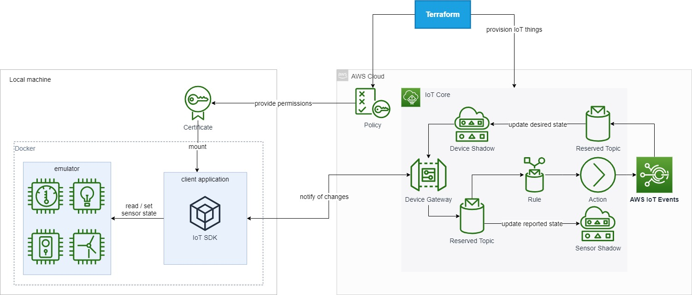

# Jupiter

This project is supposed to observe and adjust the environment climate in an art storage room. 

## Contributors

- Chris-Robin Ennen (ce053)
- Johannes Nißl (jn033)
- Karyna Kachanovska (kk153)

## Architecture

## Setup

Run `git submodule update --init --recursive` to pull the submodule containing the device emulator.

### AWS

Run `docker run --rm -it -v ~/.aws:/root/.aws amazon/aws-cli` in order to use the aws cli without installing.  
Make sure you're signed in to AWS in the console - refer to [the AWS CLI docs on how to do that](https://docs.aws.amazon.com/cli/latest/userguide/cli-chap-configure.html)

Then get your 12-digit account ID and save it to an environment variable by running `export TF_VAR_aws_account=$(docker run --rm -it -v ~/.aws:/root/.aws amazon/aws-cli sts get-caller-identity --query Account --output text)`. We'll need it later.

Also, download the Amazon root CA and place it under `certs/`, e.g. by doing `mkdir -p certs && curl https://www.amazontrust.com/repository/AmazonRootCA1.pem >> certs/root-CA.crt`.
This matches the default configuration the compose file uses.

### Node client

The client resides in the `aws` folder. Within that folder, copy the `.env.sample` file to `.env` and provide your endpoint value, which you can find by running `docker run --rm -it -v ~/.aws:/root/.aws amazon/aws-cli iot describe-endpoint`. Refer to the README in the `aws` folder for instructions on how to setup the client.

### Terraform

For Windows-Users: After installing terraform move the terraform.exe to system32. Navigate to terraform folder and run `terraform init`.

Now you should be able to provision the required infrastructure to your account by running `terraform apply` from within the terraform folder.
Enter your 12-digit personal account-ID.

## Run the project

Run `docker-compose up -d` in order to start the containers. Afterwards run the bash script `./initialize_seeds.sh` and set up your desired values for temperature and humidity.

Open `localhost:9292` in your browser to manipulate the sensors. 
